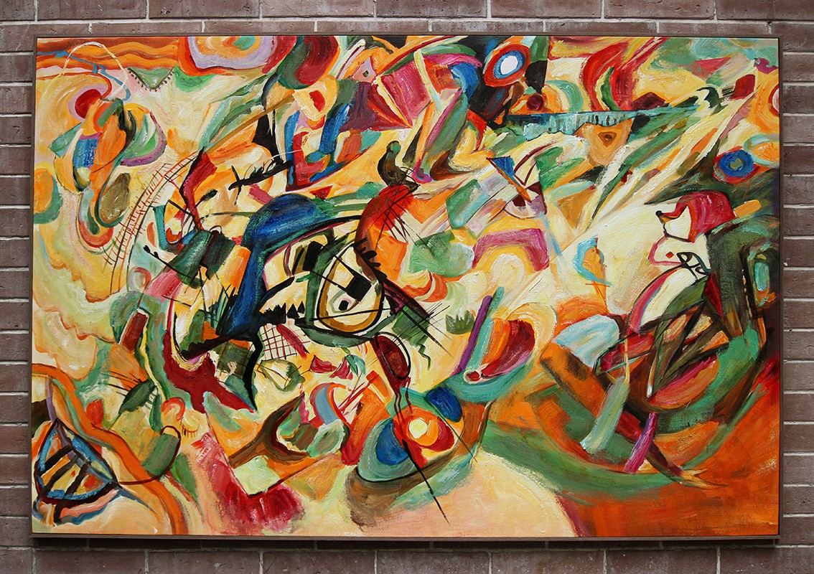
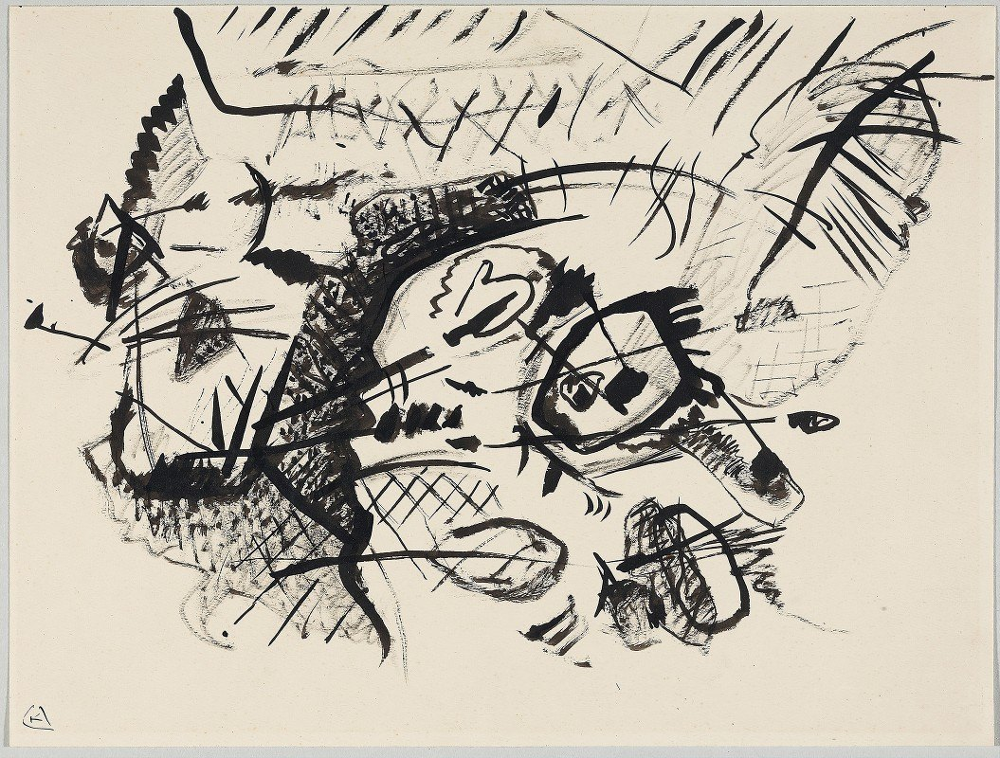
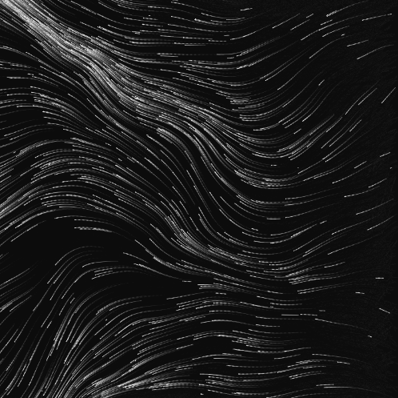

1. Imaging Technique: Fluid Lines and Distortion
    - Inspired by Wassily Kandinsky's "Composition VII," I am captivated by the fluid lines and distorted shapes that intertwine harmoniously, producing a visual dynamism. For my project, I aim to incorporate this chaotic yet controlled visual language. Given our assignment requirements, Kandinsky's abstract visual cues will allow for a diverse set of animation techniques, each capturing the essence of "Composition VII." Whether animated based on audio frequencies, timed events, random seed algorithms, or user input, the fluid and distorted nature of Kandinsky's work presents an excellent foundation for a dynamic, interactive piece that echoes the masterpiece's energy and vitality.

2. Coding Technique: Generative Art with Perlin Noise
    - Perlin Noise can create smooth curves, figures, and structures that differ in intensity, orientation, and hue, reminiscent of Kandinsky's creations. By manipulating and overlaying noise patterns, one can craft visuals that are both disorderly and balanced. This method can be tailored to mimic the intertwined forms and vibrant colors that define "Composition VII". Hence, Perlin Noise offers an apt coding approach to capture the spirit of the masterpiece.
        